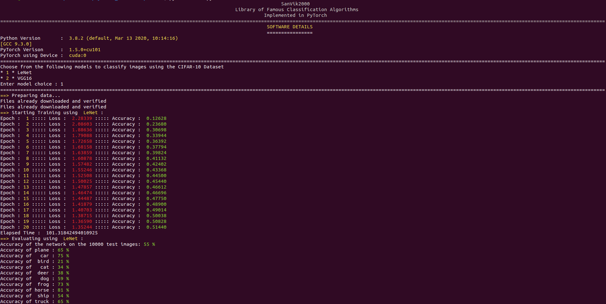
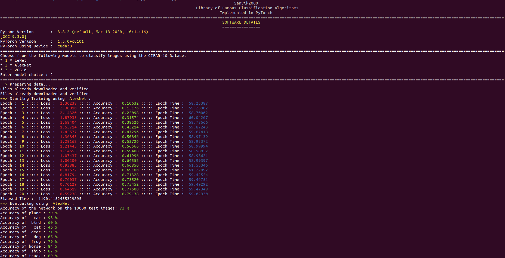
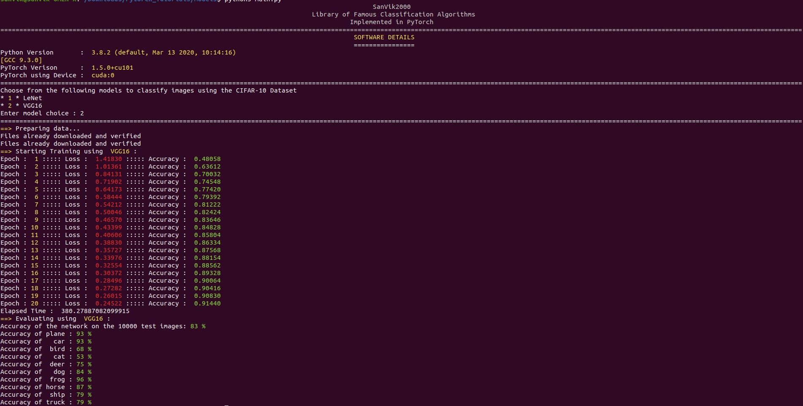

# Image_Classification
A single library for all the popular Image-Classification algorithms<br>
This project is implemented using PyTorch, and each model architecture is defined inside the corresponding .py file. For example, VGG16 architecture is defined inside VGG.py.<br>
## Running this Project
To run this project execute the following command<br>
```python3 Main.py```<br>
## Requirements
To run and test this library without any errors, the following requisites should be met:<br>
- Pytorch(With/Without GPU Compatibility)
## Results
- LeNet-5:<br>
<br>
- AlexNet:<br>
<br>
- VGG16:<br>
<br>
